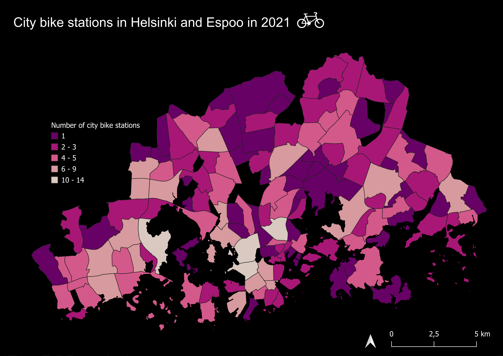

# Final portfolio in Cartographic Visualisation

[Reflection](index.md) | [Project](project.md)

---

## Cartographic reflection

Looking at my first map created during the Cartographic Visualisation course (Figure 1), I consider it fairly good. I’ll therefore start with the positive aspects of the map according to my current knowledge. Firstly, I think it is clear and visually pleasing. Most importantly, there is no excessive visual clutter. This was emphasised many times during the course – to make the map as simple as possible. I didn’t include any unnecessary borders or lines, for example around the map legend, that would attract too much attention. The colours are easily identifiable, and there are only five of them, which is within the optimal range (5–7). The map legend is situated right next to the map, which allows for optimal sight lines. The fonts and overall map readability are accessible.

However, there are still things I would change in the map if I redid it. The most important change I would make is not exactly about the visuals but about the data, which then affects the visual appearance and interpretation as well. I would divide the number of stations in districts by their areas. I don’t think this is a major problem in the current map because the legend title clearly states that the number of city bike stations is visualised. However, more meaningful patterns would be revealed if the spatial aspect were considered. This was also mentioned in the feedback on the first exercise.

In addition to that, I would add the district names in a very reserved way. It would create significantly more visual clutter, but I think the increase in informativeness would outweigh that. I experimented with different aspects of text during the course, so maybe I could come up with a good solution.

Lastly, I would add the essential information on the map about the data, basemap, and cartographer. Normally I do that, but I believe that this time I tried to approach it differently. Still, I think it is a good idea to add the essential information because you never know who will end up seeing your map. Of course, if you clearly know the context in which your map is used (e.g., in a scientific article), then the data and title on the map might not be needed.

Probably the biggest and most important insight I gained from the course is to always place the map viewer at the centre of the map creation process. Every decision you make, whether regarding the amount of information you visualise, the aesthetic choices such as colours or fonts, or the map composition, should always centre the map viewer’s perspective. The second and more “tangible” insight is learning new map making tools that have expanded my map making thinking and process, such as creating a web map, a dynamic map, and different non cartographic visuals using new QGIS plugins. These skills have changed the way I imagine creating maps; my map world has expanded from purely static maps to dynamic ones and non cartographic methods.

These new learnings will keep me discovering new options, plugins, and map making possibilities. I will continue developing my cartographic skills with curiosity. I am especially excited to start learning Python next fall to expand my cartography skills even further and discover new ways of working with spatial data.

<figure>
  
  <figcaption>Figure 1. Map from exercise 1. Map of HSL city bike stations in Helsinki and Espoo in 2021. Bike station data from Helsingin Seudun Liikenteen (HSL) and small areas from Helsinki Region Environmental Services Authority (HSY). Map was created using QGIS. Used coordinate system was EPSG:3067.</figcaption>
</figure>
---

## Data exploration of citizen study ‘Looking for Cowslips’

The project page can be accessed here:

➡️ [View Project](project.md)
