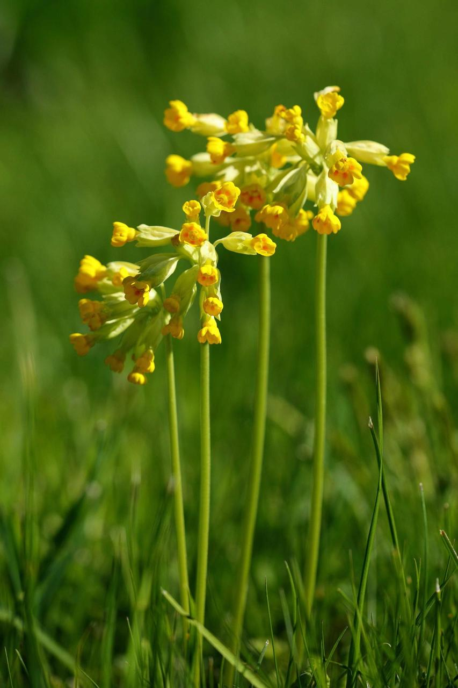
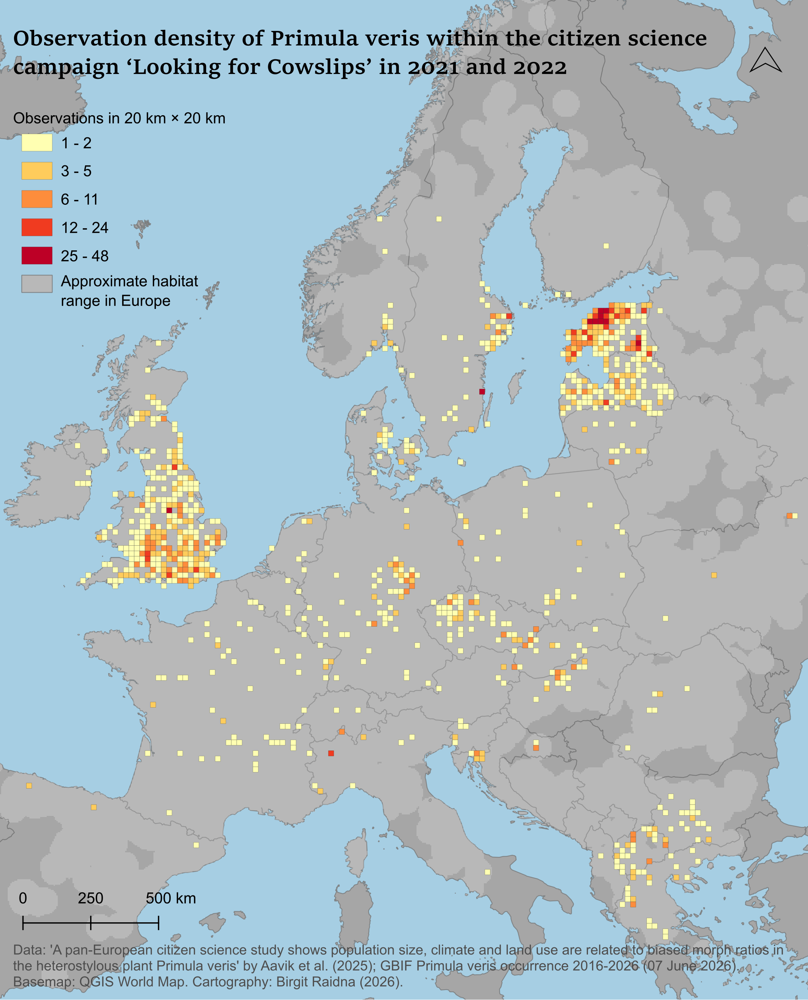
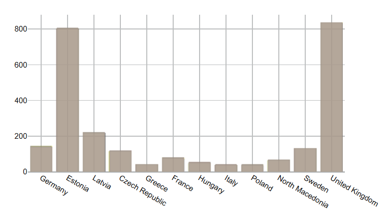

[Reflection](index.md) | [Project](project.md)

# Data exploration of citizen study ‘Looking for Cowslips’

## Introduction & data

The data I used comes from the paper “A pan-European citizen science study shows population size, climate and land use are related to biased morph ratios in the heterostylous plant Primula veris” by Aavik et al. (2026). As the title suggests, a pan-European citizen science campaign was conducted to study the heterostyly of Primula veris, also known as cowslips, which is a model species for researching this phenomenon.

The collected data is available on Dryad (Aavik et al., 2025). The dataset consists of 3,014 features (observations of Primula veris populations) with 11 fields: fid, ID, Date, Population size, S-morphs, L-morphs, Latitude, Longitude, Country, Proportion of S-morphs, and ABSdev. 2,791 of them have coordinates. People participating in the study would look into 100 flowers and record on the webpage how many of these were S- and L-morphs. In addition, they estimated the size of the population as a categorical variable with three levels: small (<100 individuals), medium (about 100–200 individuals), and large (>200 individuals). They could also geolocate their observation.

In fact, I have a personal connection with this data. The plant is edible and very commonly used for herbal teas in Estonia, where I am from. Moreover, I have uploaded a few observations of cowslips myself near my country cottage during several springs. Before this specific study, the researchers conducted a country wide study (Aavik et al., 2020), which was advertised on national television and social media. The observation-uploading process was made very easy and accessible. When they launched the pan-European study, I already knew about it and uploaded a few observations when I was at my country cottage during the season.

Since most maps I have created during my (short) GIS career have been about urban environments, I decided to choose a different topic and a different scale for this project for the sake of challenge and new insights. Biodiversity is dear to my heart and highly relevant in both urban and broader regional contexts, especially when dealing with the important question of how landscape change affects biodiversity. Biodiversity is complex and also depends on the wellbeing of pollinators. I find it fascinating how citizens can be engaged in studying such an important and large-scale challenge. In conclusion, I decided to choose a dataset that would allow me to gain new knowledge about mapmaking.

Regarding the data used, GBIF (2026) cowslip observation data (2016–2026) was also used to visualise the approximate habitat area of the plant.

<em>Figure 2. Photo of Primula veris. Looking for Cowslips (n.d.).</em>

## Geospatial narrative

Cowslip is a fairly common spring flower in Europe. As a habitat, it prefers traditionally managed grasslands but also grows elsewhere. Since this type of landscape is disappearing, the plant population has significantly declined. Cowslips are heterostylous, meaning the plant has two different types of flowers, called S- and L-morphs. The drastic change in cowslip populations has resulted in an imbalance in the occurrence of S- and L-morphs, negatively affecting the plant’s reproduction (Looking for Cowslips, n.d.).

The citizen science campaign Looking for Cowslips gathered observations from 31 countries. Not all countries where cowslip is common, such as Moldova, Serbia, Kosovo, and Bosnia and Herzegovina, were covered (Aavik et al., 2026). The campaign webpage was translated into 24 languages to reach people across Europe.

On the map below (Figure 3), we see that the countries with the most observations were Estonia, Latvia, and the UK. In addition, the grids with the highest density of observations (25–48 observations per 20 km × 20 km) were found in Estonia, Sweden, and the UK. From the bar plot (Figure 4), one can see that the highest number of observations came from the UK, Estonia, and then Latvia. The flower’s habitat, according to GBIF observations, is widespread in Europe, but this does not give us an indication about habitat density.

<em>Figure 3. Map of observation density and activity in countries. Used coordinate system was ESPG:3301.</em>

<em>Figure 4. Bar plot of highest number of cowslip observations per country (N>=35).</em>

Theoretically, the ratio of S- and L-morphs should be equal in a cowslip population for successful reproduction. The results of the study, however, found an excess of S-morphs. The smaller the population, the more frequent this phenomenon was. In addition, it was associated with higher summer precipitation and land-use intensity (Aavik et al., 2026).

The interactive map below (Figure 5) shows the locations of the observations, with the proportion of S-morphs indicated using three colours. It is important to note that although the approximate value ranges are based on the paper, the exact ranges do not match perfectly. I used the ranges 0–0.499, 0.499–0.501, and 0.501–1. Higher values (red) indicate a higher proportion of S-morphs, while lower values (blue) indicate the prevalence of L-morphs. Black values indicate equal frequencies of the two morphs. The map shows which morphs are more common in which locations. From the map alone, it is clear that equal frequencies of morphs were rare.

<iframe
src="interactive/map1/"
width="90%"
height="700"
frameborder="0">
</iframe>

<em>Figure 5. Interactive map showing S-morph frequency.</em>

In addition to morph frequency, the absolute deviation of morphs from equal frequency was studied (ABSdev). The results indicated a weak relationship with landscape and precipitation, but a strong one with population size. Higher deviation was more frequent in small populations and lower in large ones (Aavik et al., 2026).

In the following map (Figure 6), we see the deviation from equal morph frequency (ABSdev), showing how much the frequency deviates but not in which direction. Observations with population size and 50 km × 50 km hexagons with the median deviation are visualised. Hexagons with fewer than five observations were removed to avoid weakly sampled cells. For the same reason, the median was preferred over the average. All observations are included in the point layer. Although this gives an understanding of how far from equilibrium populations in a region are, simply looking at the spatial data on a map does not provide a basis for drawing conclusions.

<iframe
src="interactive/map2/"
width="90%"
height="700"
frameborder="0">
</iframe>

<em>Figure 6. Interactive map showing deviation from equal morph frequency (ABSdev) with hexagons showing median deviation.</em>

## Conclusion

The citizen science study “Looking for Cowslips”, conducted in 2021 and 2022, collected more than 2,700 observations from across Europe. The study results indicate that land use intensity, higher summer precipitation, and higher temperatures have an impact on the wellbeing of the species. Moreover, the findings suggest that human induced environmental change may indirectly affect biodiversity by altering reproductive traits (Aavik et al., 2026).

First, the collected observations from the citizen campaign were explored through observation density. Although most countries in Europe were covered, a few stood out with very high observation density. Then, the data collected within the citizen study was examined in more detail. First, the percentage of S-morphs was observed. One notices a clear minority of equal morph frequency, which is expected according to theory. Next, the absolute deviation from equal morph frequency was explored. Grid cells with median deviation give an indication of how different regions and landscapes vary in their deviation. Population size, which was the most important variable, can be used to provide further insights into deviation. Interactive maps are the most suitable tools for exploring data at such a large scale and offer flexibility in the level of detail available to the map user.

These visualisations of Looking for Cowslips allow us to explore the collected data within the study but do not allow us to draw conclusions from them. To truly understand the results and identify causal relationships while ensuring their validity, statistical data analysis must be conducted. As a possible next step, the statistical study results could be spatially visualised in some way.

However, even such simple visualisations of collected data may provide an insightful overview and perhaps even inspiration for future data analysis. One can imagine how valuable it might be for a scientist to see the collected data visualised in suitable ways after previously only viewing them in a table. For people participating in the study, seeing the collective effort visualised may also feel tangible and rewarding. In addition, it is important to note how essential non cartographic methods, such as plots, are for visualising geospatial information, as demonstrated in the research paper.

## References

Aavik, T., Carmona, C. P., Träger, S., Reitalu, T., Kivastik, M., & others. (2020). Landscape context and plant population size affect morph frequencies in heterostylous Primula veris: Results of a nationwide citizen-science campaign. Journal of Ecology, 108, 2169–2183. https://doi.org/10.1111/1365-2745.13488

Aavik, T., Reitalu, T., Kivastik, M., Reinula, I., Träger, S., Uuemaa, E., Barberis, M., Biere, A., Castro, S., Cousins, S. A. O., Csecserits, A., Dariotis, E., Fišer, Ž., Grzejszczak, G., Huu, C. N., Hool, K., Jacquemyn, H., Julien, M., Klisz, M., … Zobel, M. (2025). Data from: A pan-European citizen science study shows population size, climate and land use are related to biased morph ratios in the heterostylous plant Primula veris [Dataset]. Dryad. https://doi.org/10.5061/dryad.k3j9kd5jj

Aavik, T., Reitalu, T., Kivastik, M., Reinula, I., Träger, S., Uuemaa, E., Barberis, M., Biere, A., Castro, S., Cousins, S. A. O., Csecserits, A., Dariotis, E., Fišer, Ž., Grzejszczak, G., Huu, C. N., Hool, K., Jacquemyn, H., Julien, M., Klisz, M., … Zobel, M. (2026). A pan-European citizen science study shows population size, climate and land use are related to biased morph ratios in the heterostylous plant Primula veris. Journal of Ecology, 114, e14477. https://doi.org/10.1111/1365-2745.14477

GBIF.org. (2026, June 7). GBIF occurrence download. https://doi.org/10.15468/dl.5cd2jw

Looking for Cowslips. (n.d.). Why do we study cowslips? https://www.nurmenukk.ee/about-cowslip

---

[Back to Reflection](index.md)
